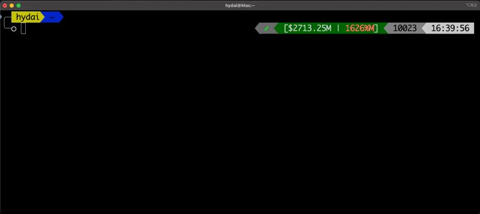

# ZSH CCUsage Plugin

A lightweight ZSH plugin that displays real-time AI usage costs from the `ccusage` CLI tool directly in your terminal prompt.


## Overview

The zsh-ccusage plugin helps developers monitor their AI usage costs in real-time by displaying the current active block cost and daily usage percentage in the terminal prompt. It prevents exceeding block limits by providing visual feedback with color-coded indicators.

## Demo



### Display Examples

| Cost Mode | Percentage Mode | Display | Description |
|-----------|-----------------|---------|-------------|
| Active | Daily Average | `[$45.23A | 35%D]` | Active block at 35% of daily budget |
| Daily | Daily Plan | `[$20.45D | 22%P]` | Today's total is 22% of monthly plan |
| Monthly | Monthly | `[$1800.00M | 185%M]` | Monthly total at 185% of plan limit |

### Visual Examples

The plugin provides different visual states based on your usage:

```
[$12.50A | 45%D]   # Green - Active block, within daily average
[$22.00D | 85%P]   # Yellow - Daily total, approaching plan limit
[$180.00M | 120%M] # Red/Bold - Monthly total, exceeded limit
[$22.00D* | 85%*]  # Asterisk - Using cached data
$12.50A|45%D       # Compact - For narrow terminals
```

## Features

- 🚀 **Multiple cost display modes** - Active block, daily total, or monthly total
- 📊 **Multiple percentage modes** - Daily average, daily plan, or monthly tracking
- 🎨 **Color-coded indicators** - Green (<80%), Yellow (80-99%), Red (≥100%)
- ⚡ **Async updates** - Non-blocking data fetching
- 💾 **Smart caching** - Reduces API calls with intelligent cache management
- 🔧 **Highly configurable** - Customize display format, update intervals, and limits
- 📱 **Responsive design** - Adapts to terminal width automatically
- 🛡️ **Robust error handling** - Gracefully handles network issues and missing dependencies

## Requirements

- ZSH 5.0 or higher
- Node.js and npm/npx (for running ccusage CLI)
- [ccusage CLI](https://github.com/yourusername/ccusage) installed or accessible via npx

## Installation

### Oh My Zsh

1. Clone the repository into your custom plugins directory:
   ```bash
   git clone https://github.com/yourusername/zsh-ccusage ${ZSH_CUSTOM:-~/.oh-my-zsh/custom}/plugins/zsh-ccusage
   ```

2. Add the plugin to your `.zshrc`:
   ```bash
   plugins=(... zsh-ccusage)
   ```

3. Reload your shell:
   ```bash
   source ~/.zshrc
   ```

### Prezto

1. Clone the repository:
   ```bash
   git clone https://github.com/yourusername/zsh-ccusage ~/zsh-ccusage
   ```

2. Add to your `.zpreztorc`:
   ```bash
   zstyle ':prezto:load' pmodule \
     ... \
     'zsh-ccusage'
   ```

3. Create a symlink:
   ```bash
   ln -s ~/zsh-ccusage ~/.zprezto/modules/zsh-ccusage
   ```

### Zinit

Add to your `.zshrc`:
```bash
zinit light yourusername/zsh-ccusage
```

### Manual Installation

1. Clone the repository:
   ```bash
   git clone https://github.com/yourusername/zsh-ccusage.git ~/zsh-ccusage
   ```

2. Source the plugin in your `.zshrc`:
   ```bash
   source ~/zsh-ccusage/zsh-ccusage.plugin.zsh
   ```

3. Reload your shell:
   ```bash
   source ~/.zshrc
   ```

## Configuration

The plugin can be configured using environment variables. Add these to your `.zshrc` before sourcing the plugin:

| Variable | Default | Description |
|----------|---------|-------------|
| `CCUSAGE_AUTO_UPDATE` | `true` | Enable/disable automatic updates on each command |
| `CCUSAGE_UPDATE_INTERVAL` | `30` | Cache duration in seconds (30 seconds) |
| `CCUSAGE_PLAN_LIMIT` | `200` | Monthly plan limit in USD for percentage calculations |
| `CCUSAGE_PERCENTAGE_MODE` | `daily_avg` | Percentage calculation mode (see below) |
| `CCUSAGE_COST_MODE` | `active` | Cost display mode (see below) |
| `CCUSAGE_DISPLAY_FORMAT` | `[$%.2f \| %d%%]` | Custom display format (printf-style) |
| `CCUSAGE_CACHE_DIR` | `$HOME/.cache/zsh-ccusage` | Directory for cache files |
| `CCUSAGE_DAILY_LIMIT` | - | **Deprecated** - Use `CCUSAGE_PLAN_LIMIT` instead |

### Percentage Modes

The `CCUSAGE_PERCENTAGE_MODE` variable controls how the usage percentage is calculated:

- **`daily_avg`** (default): Compares today's usage against the daily average of your monthly plan
  - Formula: `today's usage / (plan limit / days in month) * 100`
  - Example: $20 today with $200 plan in 31-day month = 310%D
  - Use case: Best for tracking if you're on pace to stay within monthly budget
  
- **`daily_plan`**: Compares today's usage against your full monthly plan limit
  - Formula: `today's usage / plan limit * 100`
  - Example: $100 today with $200 plan = 50%P
  - Use case: Shows how much of your total monthly budget you've used today
  
- **`monthly`**: Compares total monthly usage against your plan limit
  - Formula: `monthly usage / plan limit * 100`
  - Example: $1800 this month with $200 plan = 900%M
  - Use case: Shows your actual monthly usage vs plan limit

The mode indicator (D/P/M) is displayed after the percentage to show which calculation is being used.

#### Percentage Mode Examples

```bash
# Example 1: Developer with $200/month plan
# Current date: Day 15 of a 30-day month
# Today's usage: $20
# Monthly usage so far: $150

# daily_avg mode (default)
export CCUSAGE_PERCENTAGE_MODE=daily_avg
# Display: [$20.00 | 300%D]
# Calculation: $20 / ($200/30) = $20 / $6.67 = 300%

# daily_plan mode
export CCUSAGE_PERCENTAGE_MODE=daily_plan
# Display: [$20.00 | 10%P]
# Calculation: $20 / $200 = 10%

# monthly mode
export CCUSAGE_PERCENTAGE_MODE=monthly
# Display: [$20.00 | 75%M]
# Calculation: $150 / $200 = 75%
```

### Cost Modes

The `CCUSAGE_COST_MODE` variable controls which cost metric is displayed:

- **`active`** (default): Shows the cost of the current active block
  - Fetches using: `ccstat --quiet blocks --active --json`
  - Display suffix: 'A' (e.g., `$45.23A`)
  - Use case: Monitor cost of current work session

- **`daily`**: Shows today's total cost across all usage
  - Fetches using: `ccstat --quiet -s YYYYMMDD --json`
  - Display suffix: 'D' (e.g., `$20.45D`)
  - Use case: Track daily spending regardless of blocks

- **`monthly`**: Shows current month's total cost
  - Fetches using: `ccstat --quiet monthly -s YYYYMM01 --json`
  - Display suffix: 'M' (e.g., `$1800.00M`)
  - Use case: Monitor overall monthly spending

Each cost mode maintains its own cache to ensure fast switching between modes.

#### Cost Mode Examples

```bash
# Show active block cost (default)
export CCUSAGE_COST_MODE=active
# Display: [$45.23A | 85%D]

# Show daily total cost
export CCUSAGE_COST_MODE=daily
# Display: [$20.45D | 85%D]

# Show monthly total cost
export CCUSAGE_COST_MODE=monthly
# Display: [$1800.00M | 85%D]
```

### Cost and Percentage Mode Combinations

You can combine any cost mode with any percentage mode for maximum flexibility:

```bash
# Example 1: Monitor active block with monthly percentage
export CCUSAGE_COST_MODE=active
export CCUSAGE_PERCENTAGE_MODE=monthly
# Display: [$45.23A | 900%M]
# Shows: Current block cost is $45.23, monthly usage at 900% of plan

# Example 2: Track daily cost with daily average percentage
export CCUSAGE_COST_MODE=daily
export CCUSAGE_PERCENTAGE_MODE=daily_avg
# Display: [$20.45D | 310%D]
# Shows: Today's total is $20.45, which is 310% of daily average

# Example 3: View monthly cost with daily plan percentage
export CCUSAGE_COST_MODE=monthly
export CCUSAGE_PERCENTAGE_MODE=daily_plan
# Display: [$1800.00M | 10%P]
# Shows: Monthly total is $1800, today's usage is 10% of monthly plan
```

### Example Configuration

```bash
# Basic Configuration - Track daily average usage
export CCUSAGE_PLAN_LIMIT=200
export CCUSAGE_PERCENTAGE_MODE=daily_avg
source ~/zsh-ccusage/zsh-ccusage.plugin.zsh

# Advanced Configuration - Monitor monthly totals
export CCUSAGE_AUTO_UPDATE=true
export CCUSAGE_UPDATE_INTERVAL=60
export CCUSAGE_PLAN_LIMIT=500
export CCUSAGE_COST_MODE=monthly
export CCUSAGE_PERCENTAGE_MODE=monthly
export CCUSAGE_DISPLAY_FORMAT="AI: $%.2f (%d%%M)"
source ~/zsh-ccusage/zsh-ccusage.plugin.zsh

# Minimal Configuration - Manual updates only
export CCUSAGE_AUTO_UPDATE=false
export CCUSAGE_PERCENTAGE_MODE=daily_plan
source ~/zsh-ccusage/zsh-ccusage.plugin.zsh

# Team Configuration - Shared high limit
export CCUSAGE_PLAN_LIMIT=2000
export CCUSAGE_PERCENTAGE_MODE=monthly
export CCUSAGE_UPDATE_INTERVAL=300  # Update every 5 minutes
source ~/zsh-ccusage/zsh-ccusage.plugin.zsh
```

#### Configuration by Use Case

**For Individual Developers:**
```bash
# Track if you're on pace for your monthly budget
export CCUSAGE_COST_MODE=active      # Monitor current work session
export CCUSAGE_PERCENTAGE_MODE=daily_avg
export CCUSAGE_PLAN_LIMIT=200
```

**For Heavy Users:**
```bash
# Monitor total monthly usage closely
export CCUSAGE_COST_MODE=monthly     # See monthly totals
export CCUSAGE_PERCENTAGE_MODE=monthly
export CCUSAGE_PLAN_LIMIT=1000
export CCUSAGE_UPDATE_INTERVAL=30  # Frequent updates
```

**For Occasional Users:**
```bash
# See daily usage as portion of monthly plan
export CCUSAGE_COST_MODE=daily       # Track daily spending
export CCUSAGE_PERCENTAGE_MODE=daily_plan
export CCUSAGE_PLAN_LIMIT=100
export CCUSAGE_AUTO_UPDATE=false  # Update manually
```

**For Team Environments:**
```bash
# Monitor both active work and monthly totals
export CCUSAGE_COST_MODE=active      # Default to active blocks
export CCUSAGE_PERCENTAGE_MODE=monthly # Compare to team budget
export CCUSAGE_PLAN_LIMIT=5000       # Team monthly budget
# Use ccusage-set-cost-mode to switch views as needed
```

## Usage

### Automatic Updates

By default, the plugin automatically updates cost information in the background. The display appears in your right prompt (RPROMPT).

### Manual Refresh

Force a refresh of the cost data:
```bash
ccusage-refresh
```

### Runtime Mode Switching

Switch between cost modes without restarting your shell:
```bash
# Switch to daily cost mode
ccusage-set-cost-mode daily

# Switch to monthly cost mode
ccusage-set-cost-mode monthly

# Switch back to active block mode
ccusage-set-cost-mode active

# Show available modes and current mode
ccusage-set-cost-mode
```

### Display Format

The plugin shows information in the format: `[costMODE | percentageMODE]`

- **Cost**: Shows cost with mode suffix (e.g., $45.23A for active, $20.45D for daily, $1800.00M for monthly)
- **Percentage**: Usage percentage with mode suffix (e.g., 35%D for daily avg, 50%P for daily plan, 900%M for monthly)

#### Display States

- `[$45.23A | 35%D]` - Normal display with current data
- `[$45.23A* | 35%*]` - Asterisk indicates stale/cached data
- `[$0.00A | 0%D]` - No active blocks or usage
- `$45.23A|35%D` - Compact format for narrow terminals (<80 chars)
- `$-.--D | 85%D]` - No data available for daily cost mode

#### Color Coding

The plugin uses color coding to provide visual warnings about your usage:

- 🟢 **Green**: 0-79% of limit - Safe usage level
- 🟡 **Yellow**: 80-99% of limit - Approaching limit
- 🔴 **Red**: ≥100% of limit - Exceeded limit (may use bold formatting)

**Color Examples by Mode:**

```bash
# Daily Average Mode (daily_avg)
[$5.00A | 75%D]   # Green - On track for the month
[$6.00A | 90%D]   # Yellow - Slightly above daily average
[$10.00A | 150%D] # Red - Significantly over daily average

# Daily Plan Mode (daily_plan)
[$150.00D | 75%P]  # Green - Used 75% of monthly plan today
[$170.00D | 85%P]  # Yellow - High daily usage
[$250.00D | 125%P] # Red - Exceeded monthly plan in one day

# Monthly Mode (monthly)
[$150.00M | 75%M]  # Green - 75% of monthly plan used
[$170.00M | 85%M]  # Yellow - Approaching monthly limit
[$250.00M | 125%M] # Red - Exceeded monthly plan
```

**Cost Mode Display Examples:**

```bash
# Active Block Mode (shows current work session)
[$45.23A | 85%D]   # Active block costing $45.23
[$0.00A | 0%D]     # No active blocks

# Daily Total Mode (shows today's total)
[$120.50D | 60%P]  # Today's total is $120.50
[$-.--D | 85%D]    # Daily data unavailable

# Monthly Total Mode (shows month's total)
[$1800.00M | 900%M] # Monthly total is $1800
[$2500.00M* | 125%M*] # Using cached monthly data
```

## Migration Guide

### Migrating from CCUSAGE_DAILY_LIMIT to CCUSAGE_PLAN_LIMIT

If you were using the older `CCUSAGE_DAILY_LIMIT` variable, you'll need to update your configuration:

**Old Configuration:**
```bash
export CCUSAGE_DAILY_LIMIT=200  # This is deprecated
```

**New Configuration:**
```bash
export CCUSAGE_PLAN_LIMIT=200   # Use this instead
```

The plugin maintains backward compatibility, so `CCUSAGE_DAILY_LIMIT` will still work but will show a deprecation warning. The new `CCUSAGE_PLAN_LIMIT` better reflects that this is your monthly plan limit, not a daily limit.

### Understanding the Change

- `CCUSAGE_DAILY_LIMIT` was misleading as it actually represented your monthly plan limit
- `CCUSAGE_PLAN_LIMIT` clearly indicates this is your monthly plan amount
- All percentage calculations now reference "plan limit" instead of "daily limit"
- The default value remains $200

### Quick Migration Steps

1. Open your `.zshrc` file
2. Find any line with `export CCUSAGE_DAILY_LIMIT=`
3. Replace `CCUSAGE_DAILY_LIMIT` with `CCUSAGE_PLAN_LIMIT`
4. Save and reload your shell: `source ~/.zshrc`

## Frequently Asked Questions

### Which percentage mode should I use?

- **Use `daily_avg`** if you want to know whether you're on track to stay within your monthly budget
- **Use `daily_plan`** if you want to see how much of your total monthly allowance you've used today
- **Use `monthly`** if you want to track your cumulative monthly usage against your limit

### Why is my percentage over 100%?

This is normal and indicates you've exceeded the threshold for that mode:
- **Over 100%D**: You've used more than your daily average budget
- **Over 100%P**: You've used more than your entire monthly plan in one day
- **Over 100%M**: You've exceeded your monthly plan limit

### Can I use different limits for different projects?

Yes! You can set `CCUSAGE_PLAN_LIMIT` differently in each project's directory using tools like direnv or by sourcing project-specific configuration files.

### How do I disable the percentage display?

You can customize the display format to show only the cost:
```bash
export CCUSAGE_DISPLAY_FORMAT="[$%.2f]"
```

### What's the difference between cached data (*) and live data?

- **Live data**: Fresh data fetched from the ccusage API
- **Cached data (*)**: Previously fetched data shown when the cache is still valid or when the API is unavailable

### Which cost mode should I use?

- **Use `active`** to monitor your current work session costs in real-time
- **Use `daily`** to track your total spending for today across all sessions
- **Use `monthly`** to see your cumulative monthly costs

### Can I see different cost modes simultaneously?

Not in the same prompt, but you can quickly switch between modes using `ccusage-set-cost-mode` without restarting your shell. Each mode maintains its own cache for instant switching.

### What do the mode suffixes mean?

The suffixes help you identify which metrics you're viewing:
- **Cost suffixes**: A (active), D (daily), M (monthly)
- **Percentage suffixes**: D (daily average), P (daily plan), M (monthly)
Example: `[$45.23A | 85%D]` shows active block cost with daily average percentage

## Troubleshooting

### Plugin not displaying

1. Verify ZSH version: `echo $ZSH_VERSION` (should be 5.0+)
2. Check if plugin is loaded: `echo $plugins` (for Oh My Zsh)
3. Ensure ccstat CLI is accessible: `ccstat --version`

### No cost data showing

1. Check if ccstat is working: `ccstat blocks --active`
2. Force refresh: `ccusage-refresh`
3. Check cache directory permissions: `ls -la $HOME/.cache/zsh-ccusage`

### Slow shell startup

1. Disable automatic updates: `export CCUSAGE_AUTO_UPDATE=false`
2. Increase cache interval: `export CCUSAGE_UPDATE_INTERVAL=1800`
3. The plugin uses async loading and should have <100ms impact on startup

### Stale data indicator (*)

The asterisk indicates cached data is being used due to:
- Network connectivity issues
- ccusage API errors
- Cache still valid (within update interval)

Run `ccusage-refresh` to force an update.

## Performance

The plugin is optimized for minimal impact on shell performance:

- **Lazy loading**: Components load only when needed
- **Async updates**: Non-blocking background data fetching
- **Smart caching**: Reduces API calls and network overhead
- **Efficient parsing**: Optimized JSON parsing without external dependencies
- **Startup impact**: <100ms on average systems

## Contributing

Contributions are welcome! Please feel free to submit a Pull Request.

### Development Setup

1. Fork and clone the repository
2. Create a feature branch: `git checkout -b feature-name`
3. Make your changes
4. Test with different ZSH configurations
5. Submit a pull request

### Testing

Test the plugin with different scenarios:
```bash
# Test with no active blocks
# Test with high usage (>80%)
# Test with network disconnected
# Test with narrow terminal
```

## License

MIT License - see [LICENSE](LICENSE) file for details.

## Credits

Created for developers who want to keep track of their AI usage costs without leaving the terminal.