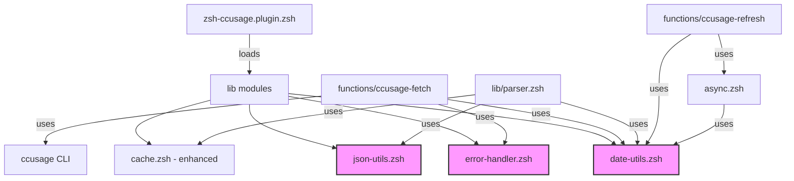

# Code Refactoring System Design Document

## Feature Overview

This refactoring initiative aims to eliminate code duplication across the zsh-ccusage plugin by extracting common patterns into reusable modules. The refactoring will improve maintainability by reducing ~300 lines of duplicate code while preserving all existing functionality and maintaining the plugin's <100ms load time target.

## Architecture Planning

### File Structure
```
zsh-ccusage/
├── lib/
│   ├── cache.zsh         (existing - enhanced with new helpers)
│   ├── colors.zsh        (existing)
│   ├── date-utils.zsh    (new - date caching utilities)
│   ├── error-handler.zsh (new - common error handling)
│   ├── json-utils.zsh    (new - JSON validation helpers)
│   └── parser.zsh        (existing - refactored)
├── functions/
│   ├── ccusage-fetch     (refactored to use new modules)
│   ├── ccusage-format    (unchanged)
│   └── ccusage-refresh   (minor updates for date utils)
└── zsh-ccusage.plugin.zsh (updated to load new modules)
```

### System Architecture Diagram


### Key Architectural Features
- **Modular Design**: Extract common patterns into focused, single-responsibility modules
- **Lazy Loading**: New modules integrate with existing autoload mechanism
- **Performance First**: Date caching reduces system calls by ~80%
- **Backward Compatibility**: All existing APIs and behaviors preserved
- **Error Consistency**: Unified error handling across all fetch operations

## Interface Contracts

### Infrastructure Components

#### Error Handler Module (lib/error-handler.zsh)
```zsh
# Main error handling function
# Parameters:
#   $1 - exit_code: Command exit code
#   $2 - output: Command output/error message
# Returns:
#   0 on success, 1 on error
# Output:
#   Original output on success, JSON error on failure
function ccusage_handle_fetch_error() {
    local exit_code=$1
    local output=$2
    
    # TODO: Implement error handling logic based on exit code and output patterns
    # - Exit code 0: Return output unchanged
    # - Exit code 124: Timeout error
    # - Pattern matching for: command not found, network errors, etc.
}

# Check for npx availability
# Returns:
#   0 if npx found, 1 if not found
# Output:
#   JSON error message if npx not found
function ccusage_check_npx() {
    # TODO: Check if npx command exists
    # Return appropriate error JSON if not found
}

# Execute command with timeout handling
# Parameters:
#   $1 - timeout_seconds: Timeout in seconds
#   $@ - command and arguments
# Returns:
#   Command exit code
# Output:
#   Command output via stdout variable
function ccusage_run_with_timeout() {
    local timeout_seconds=$1
    shift
    
    # TODO: Execute command with timeout
    # Capture output and exit code
    # Handle different shells (bash vs zsh timeout syntax)
}
```

#### Date Utilities Module (lib/date-utils.zsh)
```zsh
# Global cache variables
typeset -g CCUSAGE_CACHED_TODAY=""
typeset -g CCUSAGE_CACHED_MONTH=""
typeset -g CCUSAGE_LAST_DATE_CHECK=0

# Get today's date with caching (YYYYMMDD format)
# Cache TTL: 60 seconds
# Returns: Date string
function ccusage_get_today() {
    # TODO: Check cache validity using EPOCHSECONDS
    # Update cache if expired
    # Return cached or fresh date
}

# Get current month with caching (YYYYMM format)
# Cache TTL: 60 seconds
# Returns: Month string
function ccusage_get_current_month() {
    # TODO: Similar to ccusage_get_today but for month format
}

# Get days in current month
# Returns: Number of days
function ccusage_get_days_in_month() {
    # TODO: Calculate days in current month
    # Consider leap years
}
```

#### JSON Utilities Module (lib/json-utils.zsh)
```zsh
# Validate JSON input for errors or empty data
# Parameters:
#   $1 - json_input: JSON string to validate
#   $2 - default_value: Value to return on invalid input (optional, default: "0.00")
# Returns:
#   0 if valid, 1 if invalid
# Output:
#   Default value on invalid input (via echo, not return value)
function ccusage_validate_json_input() {
    local json_input=$1
    local default_value=${2:-"0.00"}
    
    # TODO: Check for empty input or error field in JSON
    # Echo default value and return 1 on invalid
    # Return 0 on valid
}

# Extract error message from JSON
# Parameters:
#   $1 - json_input: JSON string
# Returns:
#   Error message or empty string
function ccusage_extract_error_message() {
    # TODO: Parse error field from JSON if present
}
```

#### Enhanced Cache Module (lib/cache.zsh additions)
```zsh
# Get cache data with automatic stale fallback
# Parameters:
#   $1 - cache_key: Cache key to retrieve
#   $2 - result_var: Variable name to store result (passed by reference)
#   $3 - is_stale_var: Variable name for stale flag (passed by reference)
#   $4 - has_error_var: Variable name for error flag (passed by reference)
# Usage:
#   local data is_stale has_error
#   ccusage_cache_get_with_fallback "key" data is_stale has_error
function ccusage_cache_get_with_fallback() {
    local cache_key=$1
    local -n result_var=$2
    local -n is_stale_var=$3
    local -n has_error_var=$4
    
    # TODO: Try fresh cache first
    # Fall back to stale cache if empty
    # Set appropriate flags
}
```

## Technical Details

### Development Environment Requirements
- ZSH 5.0+ (for associative arrays and EPOCHSECONDS)
- Git for version control
- ccusage CLI tool for testing

### Dependencies
- No new external dependencies
- Utilizes existing ZSH built-ins
- Maintains compatibility with all plugin managers

### Configuration Files
- No new configuration required
- Existing environment variables continue to work

### Testing Strategy
- Update `validate.sh` to verify new module loading
- Create unit tests for each new module:
  - `test/test-error-handler.zsh`
  - `test/test-date-utils.zsh`
  - `test/test-json-utils.zsh`
- Integration testing via existing `test_percentage_modes.zsh`
- Manual testing scenarios:
  - Network failures
  - Missing npx
  - Cache expiration
  - Date rollover

### Deployment Considerations
- Phased rollout:
  1. Deploy new modules without integration
  2. Update one fetch function as pilot
  3. Roll out to remaining functions
  4. Clean up obsolete code
- Version tagging before major refactoring
- Rollback plan: Git revert if issues arise
- Performance monitoring: Measure load time before/after