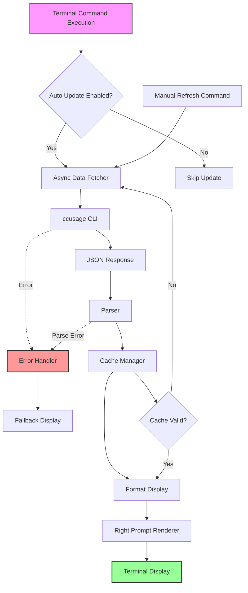

# ZSH CCUsage Plugin System Design Document

## Feature Overview
A lightweight zsh plugin that displays real-time ccusage cost information in the terminal prompt, helping developers monitor AI usage costs and prevent exceeding block limits. The plugin integrates seamlessly into the zsh environment, providing at-a-glance cost visibility without disrupting workflow.

## Architecture Planning

### File Structure
```
zsh-ccusage/
├── zsh-ccusage.plugin.zsh      # Main plugin entry point
├── functions/
│   ├── ccusage-fetch           # Data fetching function
│   ├── ccusage-format          # Display formatting function
│   └── ccusage-refresh         # Manual refresh command
├── lib/
│   ├── cache.zsh               # Cache management
│   ├── parser.zsh              # JSON parsing utilities
│   └── colors.zsh              # Color/theme utilities
├── docs/
│   └── zsh-ccusage/
│       ├── requirements.md
│       └── design.md
└── README.md
```

### System Architecture Diagram


### Key Architectural Features
- **Asynchronous Data Fetching**: Non-blocking updates preserve terminal responsiveness
- **Intelligent Caching**: Reduces API calls while maintaining data freshness
- **Graceful Degradation**: Continues functioning even when ccusage is unavailable
- **Theme Integration**: Respects zsh theme variables and color schemes
- **Modular Design**: Separate concerns for fetching, parsing, formatting, and display

## Interface Contracts

### Components

#### Business Logic Components

**CostDataFetcher**
```zsh
# Fetches cost data from ccusage CLI
# Input: none
# Output: JSON string or error
# Behavior: 
#   - Executes ccstat blocks --active --json
#   - Returns raw JSON response
#   - Handles command not found gracefully
function ccusage_fetch_active_block() {
    # TODO: Implement async execution with timeout
    # TODO: Handle npx/ccusage not available
}

# Fetches daily usage data
# Input: date in YYYYMMDD format (optional, defaults to today)
# Output: JSON string or error
function ccusage_fetch_daily() {
    # TODO: Execute ccstat daily --since $date --json
    # TODO: Auto-calculate today's date if not provided
}
```

**DataParser**
```zsh
# Parses active block cost from JSON
# Input: JSON string from ccusage
# Output: Numeric cost value or 0.00
function ccusage_parse_block_cost() {
    # TODO: Extract cost field from JSON
    # TODO: Handle malformed JSON gracefully
    # TODO: Return 0.00 for empty/no active blocks
}

# Calculates daily usage percentage
# Input: JSON string from daily usage
# Output: Percentage (0-100) based on $200 limit
function ccusage_parse_daily_percentage() {
    # TODO: Extract total cost from JSON
    # TODO: Calculate percentage against configurable limit
    # TODO: Handle edge cases (negative, over 100%)
}
```

**DisplayFormatter**
```zsh
# Formats cost data for prompt display
# Input: cost (numeric), percentage (numeric)
# Output: Formatted string with colors
function ccusage_format_display() {
    # TODO: Apply format based on CCUSAGE_DISPLAY_FORMAT
    # TODO: Add color codes based on usage levels:
    #       - Green: 0-50%
    #       - Yellow: 50-80%
    #       - Red: 80%+
    # TODO: Handle compact mode for narrow terminals
}
```

#### Infrastructure Components

**CacheManager**
```zsh
# Cache infrastructure for storing cost data
# Uses zsh associative arrays for in-memory storage

typeset -gA CCUSAGE_CACHE
typeset -gA CCUSAGE_CACHE_TIME

# Stores data in cache with timestamp
# Input: key, value
function ccusage_cache_set() {
    # TODO: Store value with current timestamp
    # TODO: Implement cache size limits
}

# Retrieves cached data if still valid
# Input: key, max_age (seconds)
# Output: Cached value or empty string
function ccusage_cache_get() {
    # TODO: Check timestamp against max_age
    # TODO: Return value if fresh, empty if stale
}
```

**PromptIntegration**
```zsh
# Integrates with zsh prompt system
# Hooks into precmd to update before each prompt

# Main update function called before each prompt
function ccusage_precmd() {
    # TODO: Check CCUSAGE_AUTO_UPDATE setting
    # TODO: Trigger async update if enabled
    # TODO: Update RPROMPT with formatted display
}

# Async wrapper for non-blocking updates
function ccusage_async_update() {
    # TODO: Use zsh/zpty or background job
    # TODO: Update cache on completion
    # TODO: Trigger prompt refresh
}
```

## Technical Details

### Development Environment Requirements
- zsh 5.0 or higher
- npx (Node.js) for ccusage CLI execution
- Terminal with Unicode and color support

### Dependencies
- ccusage CLI (accessed via npx)
- zsh built-in modules:
  - zsh/datetime (for timestamps)
  - zsh/zpty (for async execution, optional)

### Configuration Files
```zsh
# Environment variables for configuration
CCUSAGE_AUTO_UPDATE=${CCUSAGE_AUTO_UPDATE:-true}
CCUSAGE_UPDATE_INTERVAL=${CCUSAGE_UPDATE_INTERVAL:-300}  # 5 minutes
CCUSAGE_DISPLAY_FORMAT=${CCUSAGE_DISPLAY_FORMAT:-"[$cost | $percentage%]"}
CCUSAGE_PLAN_LIMIT=${CCUSAGE_PLAN_LIMIT:-200}
CCUSAGE_CACHE_DIR=${CCUSAGE_CACHE_DIR:-"$HOME/.cache/zsh-ccusage"}
```

### Testing Strategy
- Unit tests for parser functions using sample JSON responses
- Integration tests with mock ccusage responses
- Performance tests to ensure <100ms impact on prompt rendering
- Compatibility tests across different zsh versions and themes

### Deployment Considerations
- Compatible with popular zsh plugin managers (oh-my-zsh, prezto, zinit)
- No external dependencies beyond ccusage CLI
- Graceful degradation when ccusage is not available
- Minimal memory footprint with efficient caching
- Support for both interactive and non-interactive shells